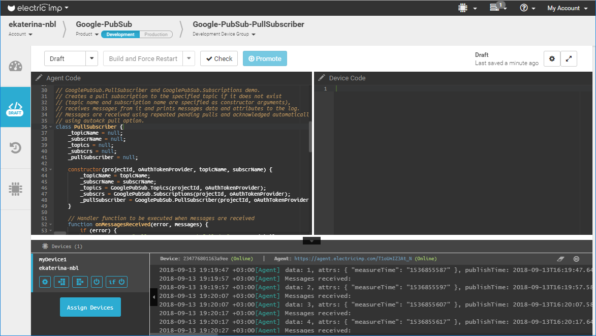
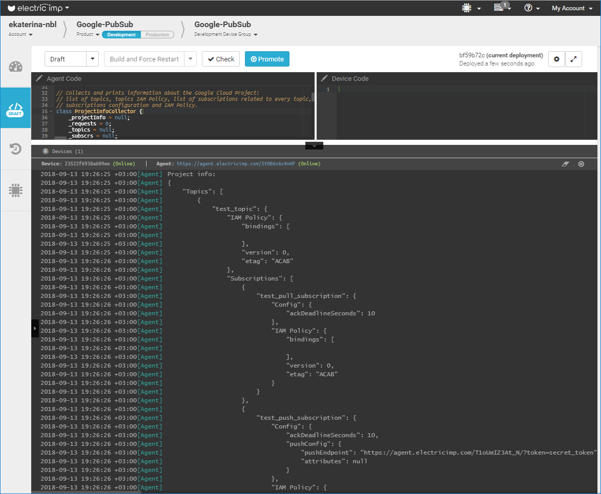
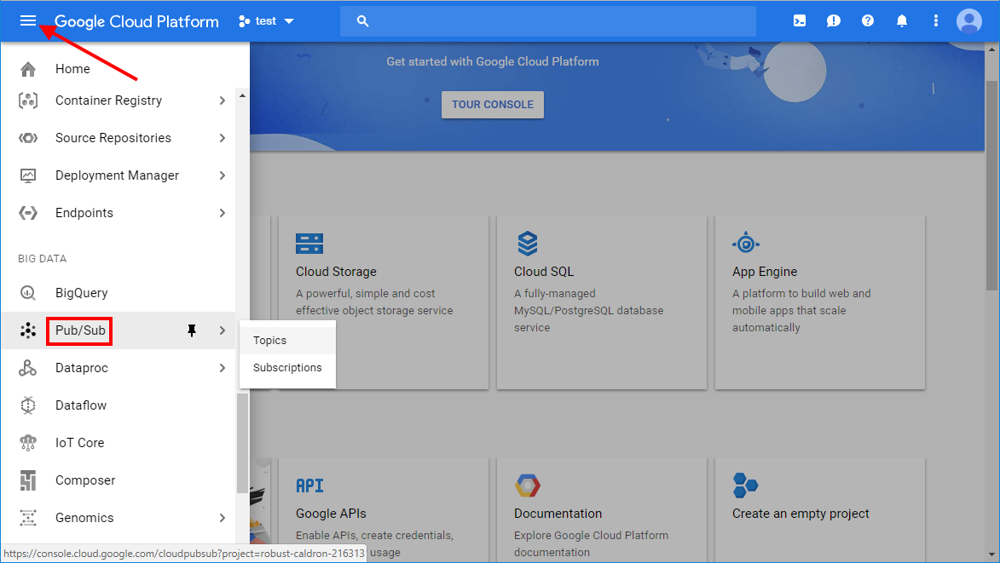
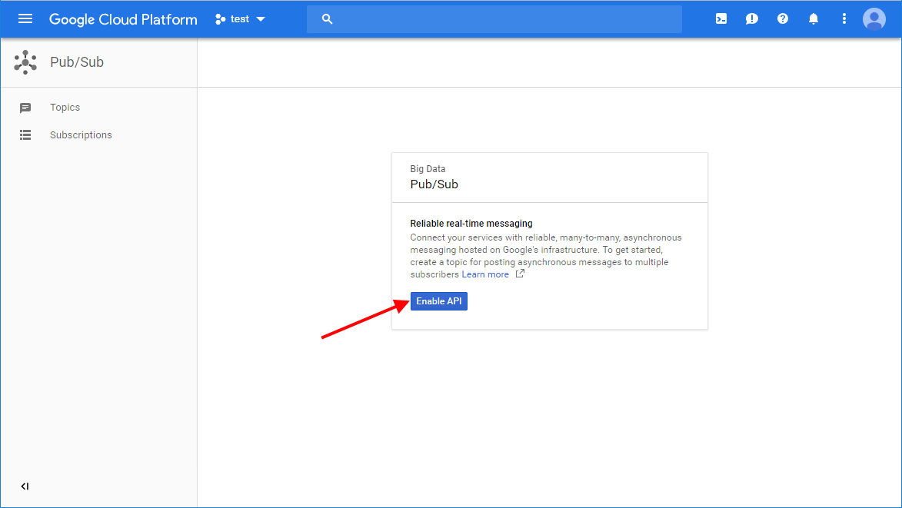
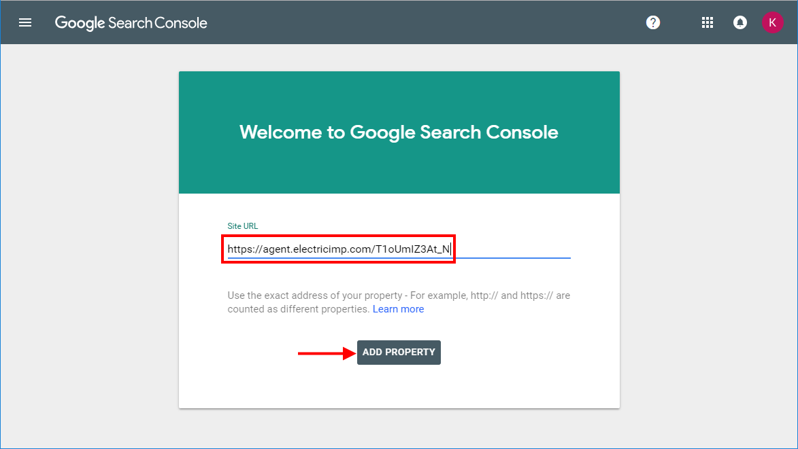
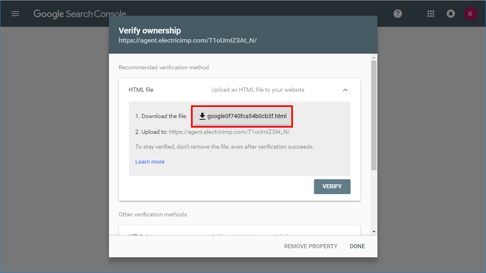
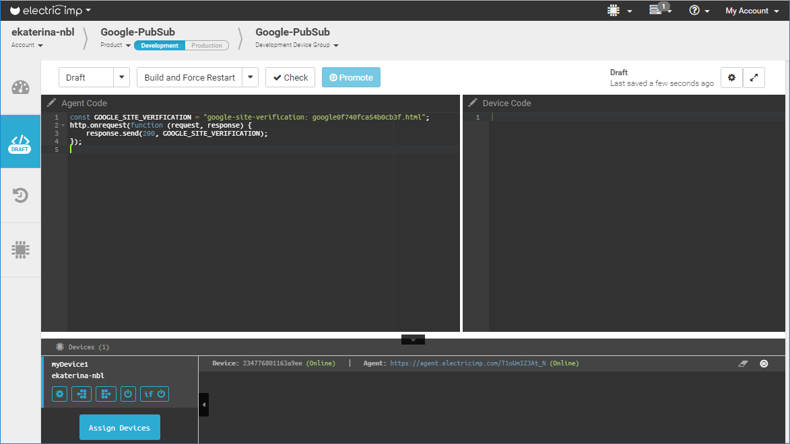

# GooglePubSub Examples

This document describes the sample applications provided with the [GooglePubSub library](../README.md).

The following example applications are provided:
- Publisher
- PullSubscriber
- PushSubscriber
- ProjectInfo

We recommend that you:
- run Publisher on the agent of one device
- run PullSubscriber on the agent of a second device
- run PushSubscriber on the agent of a third device

To see messages arriving you need to run the PullSubscriber and/or PushSubscriber examples alongside the Publisher example.

The ProjectInfo example may be run at any time. However, it displays nothing if no topics or subscriptions have been created in your project, for example by running any of the other examples.

Each example is described below. If you wish to try one out, you'll find generic and example-specific setup instructions further down the page.

## Publisher

This example publishes messages to the topic `"test_topic"`.

### Notes

- The topic `"test_topic"` is created if it does not exist.
- One message is published every ten seconds.
- Every message contains:
  - Message data in the form of an integer which starts at 1 and increases by 1 with every message published. It restarts from 1 when the example is restarted.
  - A message attribute, `"measureTime"`, which is the time in seconds since the epoch.


## PullSubscriber

This example receives messages from a pull subscription called `"test_pull_subscription"` and prints the messages content.

### Notes

- The subscription `"test_pull_subscription"` is created if it does not exist.
  - The subscription is related to the topic `"test_topic"`
  - It is a pull type subscription
- Messages are received using repeated pending pull operations.
- Messages are acknowledged automatically using the *autoAck* option of the pull operation.
- The following information is printed out for every message:
  - The value of the message data
  - All of the message’s custom attributes
  - The standard `"publishTime"` attribute.



## PushSubscriber

This example receives messages from the push subscription `"test_push_subscription"` and prints the messages content.

Additional setup is required before you can run this application. See the [Additional Setup for the PushSubscriber Example](#additional-setup-for-the-pushsubscriber-example) section below for details.

### Notes

- *"test_push_subscription"* subscription is created if it does not exist:
  - the subscription is related to *"test_topic"* topic,
  - it is a push type subscription,
  - push endpoint URL is equal to the URL of IMP agent where the application is running,
  - push subscription secret token is *"secret_token"*.
- The following information is printed out for every message:
  - value of the message data,
  - all custom attributes of the message,
  - the standard *"publishTime"* attribute.


## ProjectInfo

This example collects and prints information about topics and subscriptions. The following information is printed out:
- A list of topics
- The IAM Policy of every topic
- A list of subscriptions related to each topic
- The configuration of every subscription
- The IAM Policy of every subscription



## Examples Setup

Copy and paste the code linked below for the example you wish to run.

- [Publisher](./Publisher.agent.nut)
- [PullSubscriber](./PullSubscriber.agent.nut)
- [PushSubscriber](./PushSubscriber.agent.nut)
- [ProjectInfo](./ProjectInfo.agent.nut)

Before running an example application you need to set the configuration constants in the application (agent) source code. The instructions below will walk you through the necessary steps. The PushSubscriber exampled will need additional setup work and this is outlined [after the general steps](#additional-setup-for-the-pushsubscriber-example).

### Setup For All Examples

#### Google Cloud Account Configuration

- Login at [Google Cloud Console](https://console.cloud.google.com) in your web browser.
- If you have an existing project that you want to work with, skip this step, otherwise click the ‘Select a project’ link and click ‘NEW PROJECT’ in the opened window:

Enter a project name and click ‘Create’.
- Click the ‘Select a project’ link and choose your project.
Copy your project’s ID &mdash; it will be used as the *PROJECT_ID* constant.

Click ‘OPEN’.
- In the hamburger menu choose ‘Pub/Sub’:

- Click ‘Enable API’:


#### OAuth 2.0 JWT Profile configuration

Follow the instructions from [JWT Profile for OAuth 2.0](https://github.com/electricimp/OAuth-2.0/tree/master/examples#jwt-profile-for-oauth-20) to obtain all the required constants for OAuth 2.0 JWT Profile configuration, which you’ll need to enter into the constants *GOOGLE_ISS*, *GOOGLE_SECRET_KEY*.

#### Constants Setup

Set the example code configuration constants (*PROJECT_ID*, *GOOGLE_ISS*, *GOOGLE_SECRET_KEY*) with the values retrieved in the previous steps. You can use the same configuration constants when running examples in parallel.


### Additional Setup for the PushSubscriber Example

This must be performed **before** you use the example code. You will need to assign your device to a new model first.

#### Register the Push Endpoint

- Copy your device’s agent URL from the Electric Imp IDE.
- Go to the [Google Search Console](https://www.google.com/webmasters/tools), enter your agent URL and click ‘ADD PROPERTY’:

- Download the suggested HTML file:

- Add the following code to your agent. Make sure you enter the *GOOGLE_SITE_VERIFICATION* value with the downloaded HTML file’s contents, and then click ‘Build and Force Restart’.
```squirrel
const GOOGLE_SITE_VERIFICATION = "...";
http.onrequest(function (request, response) {
    response.send(200, GOOGLE_SITE_VERIFICATION);
});
```

This verification is needed only once per agent, and you should replace the above code with the example application code. Make sure the above code is not included in your example source code, otherwise messages will not be received.
- In the [Google Search Console](https://www.google.com/webmasters/tools) click ‘VERIFY’.

You should see “Ownership verified” success message.
- Go to the [Google Cloud Console](https://console.cloud.google.com).
- Select your project.
- In the hamburger menu choose ‘APIs & Services’, then select ‘Credentials’:

- Select ‘Domain verification’ and click ‘Add domain’:

- Enter your agent URL and click ‘ADD DOMAIN’:

