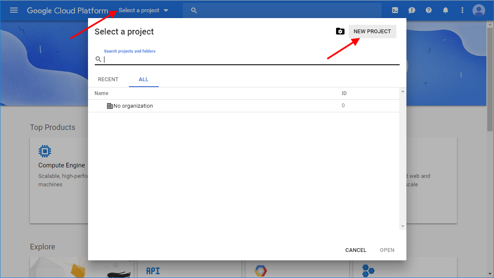
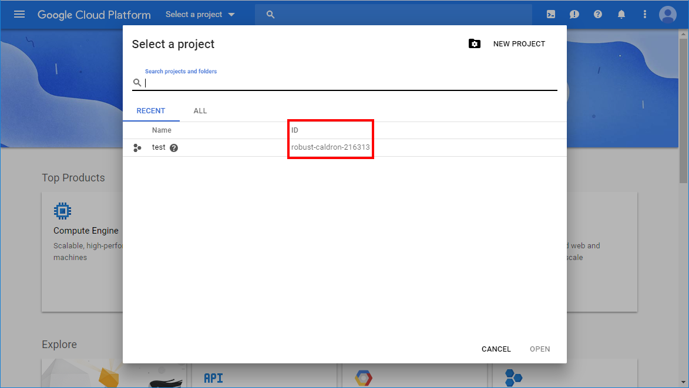
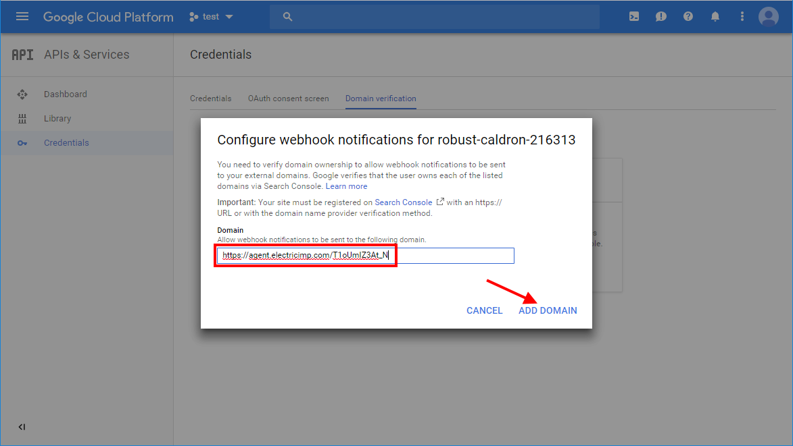

# Test Instructions

The tests in the current directory are intended to check the behavior of the GooglePubSub library. The current set of tests check:
- Pub/Sub topics manipulations using GooglePubSub.Topics methods
- Pub/Sub subscriptions manipulations using GooglePubSub.Subscriptions methods
- messages sending using GooglePubSub.Publisher methods
- messages receiving using different GooglePubSub.PullSubscriber and GooglePubSub.PushSubscriber methods
- processing of wrong parameters passed into the library methods

The tests are written for and should be used with [impt](https://github.com/electricimp/imp-central-impt). See [impt Testing Guide](https://github.com/electricimp/imp-central-impt/blob/master/TestingGuide.md) for the details of how to configure and run the tests.

The tests for GooglePubSub library require pre-setup described below.

## Google Cloud Account Configuration

- Login at [Google Cloud Console](https://console.cloud.google.com) in your web browser.
- If you have an existing project that you want to work with, skip this step, otherwise click the ‘Select a project’ link and click ‘NEW PROJECT’ in the opened window:

Enter a project name and click ‘Create’.
- Click the ‘Select a project’ link and choose your project.
Copy your project’s ID &mdash; it will be used as the *GOOGLE_PROJECT_ID* environment variable.

Click ‘OPEN’.
- In the hamburger menu choose ‘Pub/Sub’:

- Click ‘Enable API’:


## OAuth 2.0 JWT Profile configuration

Follow the instructions from [JWT Profile for OAuth 2.0](https://github.com/electricimp/OAuth-2.0/tree/master/examples#jwt-profile-for-oauth-20) to obtain all the required constants for OAuth 2.0 JWT Profile configuration, which will be used as the *GOOGLE_ISS*, *GOOGLE_SECRET_KEY* environment variables.

## Register the Push Endpoint
- Assign a device that will be used for tests execution to a Device Group.
- Copy your device’s agent URL from the Electric Imp IDE.
- Go to the [Google Search Console](https://www.google.com/webmasters/tools), enter your agent URL and click ‘ADD PROPERTY’:

- Download the suggested HTML file:

- Add the following code to your agent. Make sure you enter the *GOOGLE_SITE_VERIFICATION* value with the downloaded HTML file’s contents, and then click ‘Build and Force Restart’.
```squirrel
const GOOGLE_SITE_VERIFICATION = "...";
http.onrequest(function (request, response) {
    response.send(200, GOOGLE_SITE_VERIFICATION);
});
```

- In the [Google Search Console](https://www.google.com/webmasters/tools) click ‘VERIFY’.

You should see “Ownership verified” success message.
- Go to the [Google Cloud Console](https://console.cloud.google.com).
- Select your project.
- In the hamburger menu choose ‘APIs & Services’, then select ‘Credentials’:

- Select ‘Domain verification’ and click ‘Add domain’:

- Enter your agent URL and click ‘ADD DOMAIN’:


## Set Environment Variables

- Set the mandatory environment variables (*GOOGLE_PROJECT_ID*, *GOOGLE_ISS*, *GOOGLE_SECRET_KEY*) to the values you retrieved and saved in the previous steps.
- If needed, set optional environment variables
    - *GITHUB_USER* / *GITHUB_TOKEN* - a GitHub account username / password or personal access token. You need to specify them when you got `GitHub rate limit reached` error.
- For integration with [Travis](https://travis-ci.org) set *EI_LOGIN_KEY* environment variable to the valid impCentral login key.

## Run Tests

- See [impt Testing Guide](https://github.com/electricimp/imp-central-impt/blob/master/TestingGuide.md) for the details of how to configure and run the tests.
- Run [impt](https://github.com/electricimp/imp-central-impt) commands from the root directory of the lib. It contains a [default test configuration file](../.impt.test) which should be updated by *impt* commands for your testing environment (at least the Device Group must be updated).
